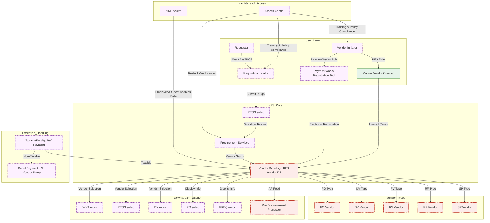
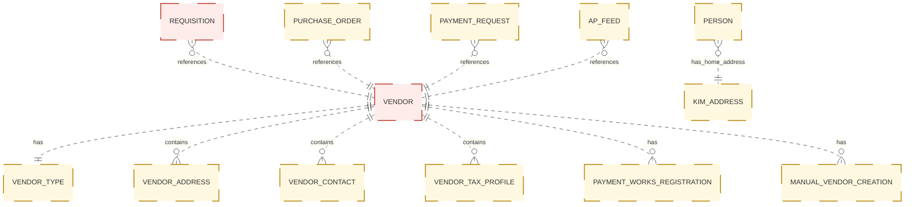

# GroundWork AI — Transformation Blueprint
**Workspace:** Test - 2
**Generated:** Recently
**Verification Protocol:** Independently Audited via NVIDIA NIM Verifier (59.4% Grounded | 92 Verified, 2 Inferred, 35 Contested, 26 Unsupported across 155 claims with 168 source citations)

### Executive Summary
The transformation blueprint establishes a unified vendor management ecosystem that delivers end‑to‑end compliance, operational efficiency, and data integrity by supporting five distinct vendor categories—Purchase Order, Disbursement Voucher, Refund & Reimbursement, Petty Cash, and Special Payments—through a centralized PVEN e‑document creation process that automatically propagates vendor records to the I Want Document, Requisition, and Disbursement Voucher interfaces, ensures real‑time visibility of vendor details on Purchase Order and Payment Request documents and on the AP feed for Pre‑Disbursement Processor customers, and mandates that all vendors reside in the KFS vendor database to guarantee feed accuracy; the architecture leverages Kuali Identity Management to furnish authoritative home‑address data for employees and students, enforces role‑based access by restricting Vendor e‑doc interaction to designated service‑center and Procurement Services groups, and embeds compliance safeguards that require KFS system access, completion of KFS Basics training, review of the Purchasing Process Overview SOP, and PO e‑doc certification before any transaction, while also providing an exception workflow for non‑taxable payments to students, faculty, and staff that bypasses vendor setup, thereby aligning operational workflows with fiscal policy, segregation‑of‑duties mandates, and audit‑ready training documentation.

---

## 2. Source Material Index
The following unstructured enterprise documentation and artifacts were ingested, semantic-chunked, and indexed to establish the grounding ledger for this blueprint:

| Document / Artifact | Source Type | Chunks Extracted | Grounding Status |
| :--- | :--- | :--- | :--- |
| **purch-po-vendor.pdf** | `document` | 14 chunks | Audited & Verified |

---

## 3. Requirements & Evidence Grounding
All business requirements extracted by the Analyst Agent under the Cite-or-Abstain contract, categorized by operational domain:

### Vendor Types, Registration & Onboarding
1. [VERIFIED] The system must support five distinct vendor types: Purchase Order (PO), Disbursement Voucher (DV), Refund & Reimbursement (RV), Petty Cash (RF), and Special Payments (SP). (Citations: 172f37e2-8013-428b-8a8c-f9694e6c6dc1)
   > Source (purch-po-vendor.pdf): 'Financial Transaction SOP: Purchasing, Vendor (Purchase Order) SOP Owner: Procurement Services Version Number, Date Revised: #2, 06/11/21 Date Implemented: Approval(s): Date Section Change 06/11/21...'
2. [VERIFIED] Vendors created via the PVEN e-doc must be available for selection in the I Want Document (IWNT), Requisition (REQS), and Disbursement Voucher (DV) e-docs. (Citations: 172f37e2-8013-428b-8a8c-f9694e6c6dc1)
   > Source (purch-po-vendor.pdf): 'Financial Transaction SOP: Purchasing, Vendor (Purchase Order) SOP Owner: Procurement Services Version Number, Date Revised: #2, 06/11/21 Date Implemented: Approval(s): Date Section Change 06/11/21...'
   > Verifier Note: Dual-model consensus verified (Nemotron & Llama agree: The source text explicitly states that vendors created using the PVEN e-doc are available for use on the I Want Document (IWNT), Requisition (REQS), and Disbursement Voucher (DV) e-docs.)
14. [VERIFIED] The majority of vendors must be registered electronically using the PaymentWorks registration tool. (Citations: c2249753-6c3e-4c1d-887e-0e125de7c7d8)
   > Source (purch-po-vendor.pdf): 'Requestor is an optional, additional step whereby a request for an item(s) to be ordered is sent to a Requisition Initiator (see below), via the I Want document, an e-SHOP assigned cart, or some ot...'
15. [VERIFIED] Vendor Initiators must have a PaymentWorks role to issue registration invitations and may have a KFS role to manually create or edit vendor records. (Citations: c2249753-6c3e-4c1d-887e-0e125de7c7d8)
   > Source (purch-po-vendor.pdf): 'Requestor is an optional, additional step whereby a request for an item(s) to be ordered is sent to a Requisition Initiator (see below), via the I Want document, an e-SHOP assigned cart, or some ot...'
16. [VERIFIED] Manual creation of new vendor records should be limited to specific cases, such as Cornell’s external organizations in Student and Campus Life. (Citations: c2249753-6c3e-4c1d-887e-0e125de7c7d8)
   > Source (purch-po-vendor.pdf): 'Requestor is an optional, additional step whereby a request for an item(s) to be ordered is sent to a Requisition Initiator (see below), via the I Want document, an e-SHOP assigned cart, or some ot...'
20. [VERIFIED] The Vendor Reviewer is a Payment Services internal role responsible for reviewing and approving all new and updated vendors, regardless of vendor type. (Citations: c2249753-6c3e-4c1d-887e-0e125de7c7d8)
   > Source (purch-po-vendor.pdf): 'Requestor is an optional, additional step whereby a request for an item(s) to be ordered is sent to a Requisition Initiator (see below), via the I Want document, an e-SHOP assigned cart, or some ot...'
23. [CONTESTED] Vendor search criteria must include Vendor Name (legal or alias), Vendor # (unique identifier), Active Indicator, Vendor Type, State, Commodity Code, and Supplier Diversity codes. (Citations: ffca7cfc-68d3-4dae-a8ed-99cab32072a9)
   > Source (purch-po-vendor.pdf): '6. Procedure Figure 1 – Main Menu, Lookup and Maintenance The first step is to determine whether the vendor exists in the KFS vendor database. When you select the Vendor from the main menu, it open...'
   > Verifier Note: Consensus contested: Nemotron evaluated as 'unsupported', while Llama evaluated as 'verified'.
28. [VERIFIED] The Vendor Contract Number field enables searching by a system‑generated contract number associated with a vendor record. (Citations: e8e0ffca-e3ed-4568-bc97-d33498d4fd21)
   > Source (purch-po-vendor.pdf): 'The codes can be assigned at time of vendor setup, but generally they are assigned when a Requisition (REQS) is submitted. • Supplier Diversity: These are the codes that designate a vendor as a sma...'
   > Verifier Note: Dual-model consensus verified (Nemotron & Llama agree: The source text states that the Vendor Contract Number field allows searching by a system-generated contract number associated with a vendor record.)
32. [VERIFIED] The REQS e‑doc must capture the vendor’s contact name, phone number, fax number, and e‑mail address in the Notes and Attachments tab; name and e‑mail are required to send the PaymentWorks registration invitation. (Citations: e8e0ffca-e3ed-4568-bc97-d33498d4fd21)
   > Source (purch-po-vendor.pdf): 'The codes can be assigned at time of vendor setup, but generally they are assigned when a Requisition (REQS) is submitted. • Supplier Diversity: These are the codes that designate a vendor as a sma...'
   > Verifier Note: Dual-model consensus verified (Nemotron & Llama agree: The source text explicitly states that the Note Text field on the REQS Notes and Attachments tab is used to capture the vendor's contact name, phone number, fax number, and e‑mail address, and that a name and e‑mail address are required to send the PaymentWorks registration invitation.)
39. [CONTESTED] Vendor Type must be selected from the predefined Vendor Type list. (Citations: 93d37098-bfd4-4309-8548-6ee84d99c2e8)
   > Source (purch-po-vendor.pdf): 'Figure 4 – System-generated message This is what causes the e-doc to route to Procurement Services. (Note: if the amount is over the APO threshold, a different system-generated message will appear;...'
   > Verifier Note: Consensus contested: Nemotron evaluated as 'verified', while Llama evaluated as 'unsupported'.
45. [CONTESTED] A W‑9 must be received and on file for most vendor types before the vendor can be approved for use. (Citations: 944fdbf0-fef4-41be-845f-c9f30fc94a07)
   > Source (purch-po-vendor.pdf): 'The ownership type is found on the tax document (i.e., W-9) submitted by the vendor. Ownership Type Category The ownership category more specifically identifies the vendor, often indicating the typ...'
   > Verifier Note: Consensus contested: Nemotron evaluated as 'verified', while Llama evaluated as 'unsupported'.
77. [VERIFIED] For e-SHOP vendors, a default commodity code must be set on the vendor record. (Citations: 9b1b213d-5dee-4de9-a8ae-414b4f57e60f)
   > Source (purch-po-vendor.pdf): 'Figure 10 – Supplier Diversity tab Table 6 Supplier Diversity, New tab: field definitions Field Name Description (* indicates a required field) Supplier Diversity * If Supplier Diversity tab is use...'
   > Verifier Note: Dual-model consensus verified (Nemotron & Llama agree: The source states that all e-SHOP vendors will have a default commodity code set on their vendor records, directly supporting the claim.)

### Roles, Governance & Approval Authority
7. [VERIFIED] Access to the Vendor e-doc is restricted to a defined group of people within the services centers and Procurement Services. (Citations: 172f37e2-8013-428b-8a8c-f9694e6c6dc1)
   > Source (purch-po-vendor.pdf): 'Financial Transaction SOP: Purchasing, Vendor (Purchase Order) SOP Owner: Procurement Services Version Number, Date Revised: #2, 06/11/21 Date Implemented: Approval(s): Date Section Change 06/11/21...'
   > Verifier Note: Dual-model consensus verified (Nemotron & Llama agree: The source states that the Vendor e-doc will be open to a defined group of people within the services centers and Procurement Services, which directly supports the claim that access is restricted to that group.)
8. [VERIFIED] Users must have KFS access, complete KFS 'Basics' training, review the KFS Purchasing Process Overview SOP and tutorial, and complete Purchase Order (PO) e-doc training before using the system. (Citations: 172f37e2-8013-428b-8a8c-f9694e6c6dc1)
   > Source (purch-po-vendor.pdf): 'Financial Transaction SOP: Purchasing, Vendor (Purchase Order) SOP Owner: Procurement Services Version Number, Date Revised: #2, 06/11/21 Date Implemented: Approval(s): Date Section Change 06/11/21...'
   > Verifier Note: Dual-model consensus verified (Nemotron & Llama agree: The source text's Prerequisites section lists exactly KFS access, KFS Basics training, KFS Purchasing Process Overview SOP, KFS Purchasing Process Overview tutorial, and Purchase Order e-doc training as required before using the system.)
10. [VERIFIED] The 'Requestor' role is not a system role but a locally delegated authority; it involves sending a request for items to a Requisition Initiator via I Want document, e-SHOP cart, or other methods. (Citations: 172f37e2-8013-428b-8a8c-f9694e6c6dc1, c2249753-6c3e-4c1d-887e-0e125de7c7d8)
   > Source (purch-po-vendor.pdf): 'Financial Transaction SOP: Purchasing, Vendor (Purchase Order) SOP Owner: Procurement Services Version Number, Date Revised: #2, 06/11/21 Date Implemented: Approval(s): Date Section Change 06/11/21...'
   > Source (purch-po-vendor.pdf): 'Requestor is an optional, additional step whereby a request for an item(s) to be ordered is sent to a Requisition Initiator (see below), via the I Want document, an e-SHOP assigned cart, or some ot...'
   > Verifier Note: Dual-model consensus verified (Nemotron & Llama agree: The source explicitly states that Requestor is not a system role, is locally delegated authority, and involves sending a request to a Requisition Initiator via I Want document, e-SHOP cart, or other methods.)
11. [VERIFIED] The Requisition (REQS) Initiator must fill in vendor details including name, mailing address, contact name, phone number, fax number, and e-mail address. (Citations: c2249753-6c3e-4c1d-887e-0e125de7c7d8)
   > Source (purch-po-vendor.pdf): 'Requestor is an optional, additional step whereby a request for an item(s) to be ordered is sent to a Requisition Initiator (see below), via the I Want document, an e-SHOP assigned cart, or some ot...'
12. [VERIFIED] Upon submission of a REQS, the workflow must route to Procurement Services to complete the vendor setup process. (Citations: c2249753-6c3e-4c1d-887e-0e125de7c7d8)
   > Source (purch-po-vendor.pdf): 'Requestor is an optional, additional step whereby a request for an item(s) to be ordered is sent to a Requisition Initiator (see below), via the I Want document, an e-SHOP assigned cart, or some ot...'
13. [CONTESTED] The Requisition Initiator is responsible for validating that a Requestor's submission complies with Cornell’s policy and business rules. (Citations: c2249753-6c3e-4c1d-887e-0e125de7c7d8)
   > Source (purch-po-vendor.pdf): 'Requestor is an optional, additional step whereby a request for an item(s) to be ordered is sent to a Requisition Initiator (see below), via the I Want document, an e-SHOP assigned cart, or some ot...'
   > Verifier Note: Consensus contested: Nemotron evaluated as 'verified', while Llama evaluated as 'unsupported'.
17. [VERIFIED] When filling out the Vendor e-doc, the Vendor Initiator must attach the Vendor Information Form, IRS Form W-9, and any applicable documentation. (Citations: c2249753-6c3e-4c1d-887e-0e125de7c7d8)
   > Source (purch-po-vendor.pdf): 'Requestor is an optional, additional step whereby a request for an item(s) to be ordered is sent to a Requisition Initiator (see below), via the I Want document, an e-SHOP assigned cart, or some ot...'
19. [VERIFIED] Staff in all workflow roles (Requestor, Initiator, Editor, Approver) associated with the Vendor e-doc must be familiar with CIT security policies regarding sensitive data. (Citations: c2249753-6c3e-4c1d-887e-0e125de7c7d8)
   > Source (purch-po-vendor.pdf): 'Requestor is an optional, additional step whereby a request for an item(s) to be ordered is sent to a Requisition Initiator (see below), via the I Want document, an e-SHOP assigned cart, or some ot...'
30. [CONTESTED] Access to sensitive vendor data (taxpayer identification numbers, notes, attachments) is restricted based on assigned KFS roles in accordance with CU‑security policy. (Citations: e8e0ffca-e3ed-4568-bc97-d33498d4fd21)
   > Source (purch-po-vendor.pdf): 'The codes can be assigned at time of vendor setup, but generally they are assigned when a Requisition (REQS) is submitted. • Supplier Diversity: These are the codes that designate a vendor as a sma...'
   > Verifier Note: Consensus contested: Nemotron evaluated as 'verified', while Llama evaluated as 'unsupported'.
33. [CONTESTED] Upon submission, the REQS e‑doc routes to the appropriate fiscal officer; if the vendor was not selected from the vendor database, the system generates the message “Requisition did not become an APO because: Vendor was not selected from the vendor database.” and routes the document to Procurement Services. (Citations: e8e0ffca-e3ed-4568-bc97-d33498d4fd21)
   > Source (purch-po-vendor.pdf): 'The codes can be assigned at time of vendor setup, but generally they are assigned when a Requisition (REQS) is submitted. • Supplier Diversity: These are the codes that designate a vendor as a sma...'
   > Verifier Note: Consensus contested: Nemotron evaluated as 'verified', while Llama evaluated as 'unsupported'.
34. [CONTESTED] If the REQS amount exceeds the APO threshold, a different system‑generated message appears, but the e‑doc still routes to Procurement Services. (Citations: 93d37098-bfd4-4309-8548-6ee84d99c2e8)
   > Source (purch-po-vendor.pdf): 'Figure 4 – System-generated message This is what causes the e-doc to route to Procurement Services. (Note: if the amount is over the APO threshold, a different system-generated message will appear;...'
   > Verifier Note: Consensus contested: Nemotron evaluated as 'verified', while Llama evaluated as 'unsupported'.
41. [VERIFIED] Tax Number is required for non‑foreign vendors; the field is masked for staff without the appropriate roles. (Citations: 93d37098-bfd4-4309-8548-6ee84d99c2e8)
   > Source (purch-po-vendor.pdf): 'Figure 4 – System-generated message This is what causes the e-doc to route to Procurement Services. (Note: if the amount is over the APO threshold, a different system-generated message will appear;...'
51. [CONTESTED] Foreign Tax Number is required for foreign vendors; the field is masked for staff without appropriate roles. (Citations: 944fdbf0-fef4-41be-845f-c9f30fc94a07)
   > Source (purch-po-vendor.pdf): 'The ownership type is found on the tax document (i.e., W-9) submitted by the vendor. Ownership Type Category The ownership category more specifically identifies the vendor, often indicating the typ...'
   > Verifier Note: Consensus contested: Nemotron evaluated as 'unsupported', while Llama evaluated as 'verified'.
62. [VERIFIED] When a vendor is marked as Restricted, the system must automatically display the Restricted Date, the Restricted Person Name (e-doc initiator), and the Restricted By Principal Name (NetID and person's name). (Citations: 213b57e9-21c0-45fb-93e0-17d63b396c44, be53d1c6-4924-4e94-b52e-e68983a5c67c)
   > Source (purch-po-vendor.pdf): 'System generated. Restricted Person Name The system automatically displays name of e-doc initiator when Yes is selected for Restricted. Restricted By Principal Name Principal name is NetID and pers...'
   > Source (purch-po-vendor.pdf): 'Yes in this field will prevent a requisition to the vendor from being processed. Note: information in the Notes and Attachments field will indicate why the vendor was debarred and / or the source o...'
82. [CONTESTED] The Insurance Required checkbox may only be checked by Procurement Services staff. (Citations: cab59c8b-cffa-49fb-a3d5-29de9ea73d6a)
   > Source (purch-po-vendor.pdf): 'Commodity Default Indicator Active Indicator Search Alias tab Search Alias tab is used to define other names that may be used when searching for this vendor. Figure 13 – Search Alias tab Table 9 Se...'
   > Verifier Note: Consensus contested: Nemotron evaluated as 'verified', while Llama evaluated as 'unsupported'.
83. [VERIFIED] The Insurance Requirements Complete field may only be set by Procurement Services staff. (Citations: cab59c8b-cffa-49fb-a3d5-29de9ea73d6a)
   > Source (purch-po-vendor.pdf): 'Commodity Default Indicator Active Indicator Search Alias tab Search Alias tab is used to define other names that may be used when searching for this vendor. Figure 13 – Search Alias tab Table 9 Se...'
   > Verifier Note: Dual-model consensus verified (Nemotron & Llama agree: The source text explicitly states that the Insurance Requirements Complete field should only be set by Procurement Services staff.)
110. [VERIFIED] The 'CU Vendor Initiator' role is limited to Procurement or Service Center staff and is responsible for initiating REQS e-docs and entering limited vendor information if the vendor is not in the system. (Citations: f5f24b96-a61c-4d4b-ac16-cfdec746b3b8)
   > Source (purch-po-vendor.pdf): 'A division has a different name from the parent. Note: in order to be recognized as a division, the child must be using the same tax identification number as the parent. Figure 19 – Create division...'
111. [VERIFIED] The 'Vendor Reviewer' role is limited and is responsible for approving e-docs. (Citations: f5f24b96-a61c-4d4b-ac16-cfdec746b3b8)
   > Source (purch-po-vendor.pdf): 'A division has a different name from the parent. Note: in order to be recognized as a division, the child must be using the same tax identification number as the parent. Figure 19 – Create division...'
112. [CONTESTED] The 'Requisition Initiator' role is responsible for initiating REQS for the Requestor. (Citations: f5f24b96-a61c-4d4b-ac16-cfdec746b3b8)
   > Source (purch-po-vendor.pdf): 'A division has a different name from the parent. Note: in order to be recognized as a division, the child must be using the same tax identification number as the parent. Figure 19 – Create division...'
   > Verifier Note: Consensus contested: Nemotron evaluated as 'verified', while Llama evaluated as 'unsupported'.

### Vendor Lookup, Search & Catalog Management
21. [CONTESTED] The first step in the procedure is to determine if the vendor exists in the KFS vendor database using the Vendor Lookup screen. (Citations: c2249753-6c3e-4c1d-887e-0e125de7c7d8, ffca7cfc-68d3-4dae-a8ed-99cab32072a9)
   > Source (purch-po-vendor.pdf): 'Requestor is an optional, additional step whereby a request for an item(s) to be ordered is sent to a Requisition Initiator (see below), via the I Want document, an e-SHOP assigned cart, or some ot...'
   > Source (purch-po-vendor.pdf): '6. Procedure Figure 1 – Main Menu, Lookup and Maintenance The first step is to determine whether the vendor exists in the KFS vendor database. When you select the Vendor from the main menu, it open...'
   > Verifier Note: Consensus contested: Nemotron evaluated as 'verified', while Llama evaluated as 'unsupported'.
22. [VERIFIED] The Vendor Lookup screen must enable searching for both active and inactive vendors. (Citations: ffca7cfc-68d3-4dae-a8ed-99cab32072a9)
   > Source (purch-po-vendor.pdf): '6. Procedure Figure 1 – Main Menu, Lookup and Maintenance The first step is to determine whether the vendor exists in the KFS vendor database. When you select the Vendor from the main menu, it open...'
   > Verifier Note: Dual-model consensus verified (Nemotron & Llama agree: The source text explicitly states that the Vendor Lookup screen enables users to search for existing vendors (both active and inactive) in the vendor database.)
24. [VERIFIED] The search functionality must support wildcard (*) features for partial name searches. (Citations: ffca7cfc-68d3-4dae-a8ed-99cab32072a9)
   > Source (purch-po-vendor.pdf): '6. Procedure Figure 1 – Main Menu, Lookup and Maintenance The first step is to determine whether the vendor exists in the KFS vendor database. When you select the Vendor from the main menu, it open...'
25. [CONTESTED] Commodity codes are generally assigned to vendors when a Requisition (REQS) is submitted, though they can be assigned at setup. (Citations: ffca7cfc-68d3-4dae-a8ed-99cab32072a9)
   > Source (purch-po-vendor.pdf): '6. Procedure Figure 1 – Main Menu, Lookup and Maintenance The first step is to determine whether the vendor exists in the KFS vendor database. When you select the Vendor from the main menu, it open...'
   > Verifier Note: Consensus contested: Nemotron evaluated as 'verified', while Llama evaluated as 'unsupported'.
26. [CONTESTED] Supplier Diversity codes must designate a vendor as a small and/or diverse business. (Citations: e8e0ffca-e3ed-4568-bc97-d33498d4fd21, ffca7cfc-68d3-4dae-a8ed-99cab32072a9)
   > Source (purch-po-vendor.pdf): 'The codes can be assigned at time of vendor setup, but generally they are assigned when a Requisition (REQS) is submitted. • Supplier Diversity: These are the codes that designate a vendor as a sma...'
   > Source (purch-po-vendor.pdf): '6. Procedure Figure 1 – Main Menu, Lookup and Maintenance The first step is to determine whether the vendor exists in the KFS vendor database. When you select the Vendor from the main menu, it open...'
   > Verifier Note: Consensus contested: Nemotron evaluated as 'verified', while Llama evaluated as 'unsupported'.
72. [VERIFIED] The Supplier Diversity tab must indicate the category of supplier diversity (e.g., small business, woman/minority owned, local) if the tab is used. (Citations: cc484c5c-7b6a-4203-864d-b888d8f83a6f)
   > Source (purch-po-vendor.pdf): 'URL The URL associated with a vendor address. Vendor Fax Number The vendor fax number. E-mail Address Appropriate e-mail address. Set as Default Address Every PO vendor may have one default PO addr...'
73. [VERIFIED] If the Supplier Diversity tab is used, the Supplier Diversity field must indicate the category of supplier diversity. (Citations: 9b1b213d-5dee-4de9-a8ae-414b4f57e60f)
   > Source (purch-po-vendor.pdf): 'Figure 10 – Supplier Diversity tab Table 6 Supplier Diversity, New tab: field definitions Field Name Description (* indicates a required field) Supplier Diversity * If Supplier Diversity tab is use...'
   > Verifier Note: Dual-model consensus verified (Nemotron & Llama agree: The source states that if the Supplier Diversity tab is used, the Supplier Diversity field indicates the category of supplier diversity and is marked as required.)
74. [VERIFIED] The Supplier Diversity Certification Expiration Date must be a date in the future. (Citations: 9b1b213d-5dee-4de9-a8ae-414b4f57e60f)
   > Source (purch-po-vendor.pdf): 'Figure 10 – Supplier Diversity tab Table 6 Supplier Diversity, New tab: field definitions Field Name Description (* indicates a required field) Supplier Diversity * If Supplier Diversity tab is use...'
   > Verifier Note: Dual-model consensus verified (Nemotron & Llama agree: The source text states that the Supplier Diversity Certification Expiration Date can only be a date in the future.)
78. [VERIFIED] The Commodity Code field is required for e-SHOP vendors and is system-generated based on the commodity code used on a REQS, though a Contract Manager may also add a commodity code to the vendor e-doc. (Citations: 9b1b213d-5dee-4de9-a8ae-414b4f57e60f)
   > Source (purch-po-vendor.pdf): 'Figure 10 – Supplier Diversity tab Table 6 Supplier Diversity, New tab: field definitions Field Name Description (* indicates a required field) Supplier Diversity * If Supplier Diversity tab is use...'
79. [CONTESTED] The Search Alias Name field is required when defining alternate names for vendor search. (Citations: cab59c8b-cffa-49fb-a3d5-29de9ea73d6a)
   > Source (purch-po-vendor.pdf): 'Commodity Default Indicator Active Indicator Search Alias tab Search Alias tab is used to define other names that may be used when searching for this vendor. Figure 13 – Search Alias tab Table 9 Se...'
   > Verifier Note: Consensus contested: Nemotron evaluated as 'verified', while Llama evaluated as 'unsupported'.
91. [VERIFIED] Vendor Contract Number is a unique system-generated number associated with each vendor contract. (Citations: 5a93eba2-9297-4267-8865-e0f9a62c7e8a)
   > Source (purch-po-vendor.pdf): 'Cornell Additional CU must be named as the additional insured on the certificate of insurance. Insured General Liability Coverage Amount The amount of general liability coverage the vendor carries....'
   > Verifier Note: Dual-model consensus verified (Nemotron & Llama agree: The source text explicitly states: 'Vendor Contract Number: This is a unique system-generated number associated with each vendor contract.')
107. [VERIFIED] The 'Active Indicator' field uses a checkbox to denote if the contract is active. (Citations: baaa0187-9ed4-4745-a422-406e2f8cea79)
   > Source (purch-po-vendor.pdf): 'Figure 18 – Contracts tab Table 13 Contracts tab: field definitions Field Name Description (* indicates a required field) Vendor Contract Number This is a unique system-generated number associated...'

### Compliance, Tax & Data Security Policies
5. [VERIFIED] Payments to students, faculty, and staff should generally be processed without setting them up as vendors, unless the payment is taxable. (Citations: 172f37e2-8013-428b-8a8c-f9694e6c6dc1)
   > Source (purch-po-vendor.pdf): 'Financial Transaction SOP: Purchasing, Vendor (Purchase Order) SOP Owner: Procurement Services Version Number, Date Revised: #2, 06/11/21 Date Implemented: Approval(s): Date Section Change 06/11/21...'
6. [VERIFIED] The Kuali Identity Management (KIM) system must provide address data for employees and students, specifically configured to provide the home address for employees. (Citations: 172f37e2-8013-428b-8a8c-f9694e6c6dc1)
   > Source (purch-po-vendor.pdf): 'Financial Transaction SOP: Purchasing, Vendor (Purchase Order) SOP Owner: Procurement Services Version Number, Date Revised: #2, 06/11/21 Date Implemented: Approval(s): Date Section Change 06/11/21...'
9. [VERIFIED] The system and processes must comply with University Policies 3.25 (Procurement of Goods and Services and Buying Manual), 4.7 (Retention of University Records), and 5.10 (Information Security). (Citations: 172f37e2-8013-428b-8a8c-f9694e6c6dc1)
   > Source (purch-po-vendor.pdf): 'Financial Transaction SOP: Purchasing, Vendor (Purchase Order) SOP Owner: Procurement Services Version Number, Date Revised: #2, 06/11/21 Date Implemented: Approval(s): Date Section Change 06/11/21...'
18. [VERIFIED] Visual Compliance screening is required for all new vendors. (Citations: c2249753-6c3e-4c1d-887e-0e125de7c7d8)
   > Source (purch-po-vendor.pdf): 'Requestor is an optional, additional step whereby a request for an item(s) to be ordered is sent to a Requisition Initiator (see below), via the I Want document, an e-SHOP assigned cart, or some ot...'
42. [VERIFIED] Tax Number Type must describe the tax number entered in the Tax Number field. (Citations: 93d37098-bfd4-4309-8548-6ee84d99c2e8)
   > Source (purch-po-vendor.pdf): 'Figure 4 – System-generated message This is what causes the e-doc to route to Procurement Services. (Note: if the amount is over the APO threshold, a different system-generated message will appear;...'
68. [VERIFIED] If the tax address differs from the required address type, it must be entered separately. (Citations: 213b57e9-21c0-45fb-93e0-17d63b396c44)
   > Source (purch-po-vendor.pdf): 'System generated. Restricted Person Name The system automatically displays name of e-doc initiator when Yes is selected for Restricted. Restricted By Principal Name Principal name is NetID and pers...'
69. [VERIFIED] Every PO vendor may have one default PO address and one default Remit address, but a default Tax address may not be set. (Citations: 213b57e9-21c0-45fb-93e0-17d63b396c44, cc484c5c-7b6a-4203-864d-b888d8f83a6f)
   > Source (purch-po-vendor.pdf): 'System generated. Restricted Person Name The system automatically displays name of e-doc initiator when Yes is selected for Restricted. Restricted By Principal Name Principal name is NetID and pers...'
   > Source (purch-po-vendor.pdf): 'URL The URL associated with a vendor address. Vendor Fax Number The vendor fax number. E-mail Address Appropriate e-mail address. Set as Default Address Every PO vendor may have one default PO addr...'
   > Verifier Note: Dual-model consensus verified (Nemotron & Llama agree: The source explicitly states that every PO vendor may have one default PO address and one default Remit address, and notes that you may not set a default Tax address.)
87. [CONTESTED] Excess Liability Umbrella Policy Expiration date must be a date in the future. (Citations: 5a93eba2-9297-4267-8865-e0f9a62c7e8a)
   > Source (purch-po-vendor.pdf): 'Cornell Additional CU must be named as the additional insured on the certificate of insurance. Insured General Liability Coverage Amount The amount of general liability coverage the vendor carries....'
   > Verifier Note: Consensus contested: Nemotron evaluated as 'verified', while Llama evaluated as 'unsupported'.
108. [CONTESTED] The 'Create Division' feature allows adding separate divisions or branches without duplicating corporate information, provided the division uses the same Tax ID as the parent vendor but has a different name. (Citations: baaa0187-9ed4-4745-a422-406e2f8cea79, f5f24b96-a61c-4d4b-ac16-cfdec746b3b8)
   > Source (purch-po-vendor.pdf): 'Figure 18 – Contracts tab Table 13 Contracts tab: field definitions Field Name Description (* indicates a required field) Vendor Contract Number This is a unique system-generated number associated...'
   > Source (purch-po-vendor.pdf): 'A division has a different name from the parent. Note: in order to be recognized as a division, the child must be using the same tax identification number as the parent. Figure 19 – Create division...'
   > Verifier Note: Consensus contested: Nemotron evaluated as 'verified', while Llama evaluated as 'unsupported'.

### Requisition Workflow, Routing & E-Docs
3. [VERIFIED] Vendor information must be displayed on the Purchase Order (PO) and Payment Request (PREQ) e-docs, as well as on the AP feed for Pre-Disbursement Processor (PDP) customers. (Citations: 172f37e2-8013-428b-8a8c-f9694e6c6dc1)
   > Source (purch-po-vendor.pdf): 'Financial Transaction SOP: Purchasing, Vendor (Purchase Order) SOP Owner: Procurement Services Version Number, Date Revised: #2, 06/11/21 Date Implemented: Approval(s): Date Section Change 06/11/21...'
4. [VERIFIED] For the AP feed to function correctly, vendors must exist in the KFS vendor database. (Citations: 172f37e2-8013-428b-8a8c-f9694e6c6dc1)
   > Source (purch-po-vendor.pdf): 'Financial Transaction SOP: Purchasing, Vendor (Purchase Order) SOP Owner: Procurement Services Version Number, Date Revised: #2, 06/11/21 Date Implemented: Approval(s): Date Section Change 06/11/21...'
27. [VERIFIED] Vendor codes may be assigned at vendor setup or when a Requisition (REQS) is submitted. (Citations: e8e0ffca-e3ed-4568-bc97-d33498d4fd21)
   > Source (purch-po-vendor.pdf): 'The codes can be assigned at time of vendor setup, but generally they are assigned when a Requisition (REQS) is submitted. • Supplier Diversity: These are the codes that designate a vendor as a sma...'
   > Verifier Note: Dual-model consensus verified (Nemotron & Llama agree: The source text states that vendor codes can be assigned at vendor setup and are generally assigned when a Requisition (REQS) is submitted, directly supporting the claim.)
31. [VERIFIED] If a vendor is not present in the vendor database, a new vendor must be created via a Requisition (REQS) e‑doc using the Suggested Vendor field on the Vendor tab. (Citations: e8e0ffca-e3ed-4568-bc97-d33498d4fd21)
   > Source (purch-po-vendor.pdf): 'The codes can be assigned at time of vendor setup, but generally they are assigned when a Requisition (REQS) is submitted. • Supplier Diversity: These are the codes that designate a vendor as a sma...'
   > Verifier Note: Dual-model consensus verified (Nemotron & Llama agree: The source states that when a vendor is not found in the system, you must create a new vendor using a Requisition (REQS) e‑doc and enter the vendor’s name in the Suggested Vendor field on the Vendor tab.)
54. [VERIFIED] If the Debarred flag is set to Yes, Cornell is prohibited from doing business with the vendor and any requisition to that vendor is blocked. (Citations: 944fdbf0-fef4-41be-845f-c9f30fc94a07)
   > Source (purch-po-vendor.pdf): 'The ownership type is found on the tax document (i.e., W-9) submitted by the vendor. Ownership Type Category The ownership category more specifically identifies the vendor, often indicating the typ...'
56. [UNSUPPORTED] Selecting 'Yes' in the Debarred field prevents any requisition to the vendor from being processed. (Citations: be53d1c6-4924-4e94-b52e-e68983a5c67c)
   > Source (purch-po-vendor.pdf): 'Yes in this field will prevent a requisition to the vendor from being processed. Note: information in the Notes and Attachments field will indicate why the vendor was debarred and / or the source o...'
   > Verifier Note: Dual-model consensus unsupported (Nemotron & Llama agree: The source text states that selecting 'Yes' in a field prevents requisitions, but it does not identify that field as the Debarred field, so the claim is not directly supported.)
61. [CONTESTED] Restricted vendors are ineligible for APOs (Accounts Payable Orders), and all requisitions to restricted vendors must route to a contract manager. (Citations: be53d1c6-4924-4e94-b52e-e68983a5c67c)
   > Source (purch-po-vendor.pdf): 'Yes in this field will prevent a requisition to the vendor from being processed. Note: information in the Notes and Attachments field will indicate why the vendor was debarred and / or the source o...'
   > Verifier Note: Consensus contested: Nemotron evaluated as 'verified', while Llama evaluated as 'unsupported'.
64. [VERIFIED] The Remit Name field is for informational purposes only and does not carry forward to payment requests or disbursement vouchers. (Citations: 213b57e9-21c0-45fb-93e0-17d63b396c44)
   > Source (purch-po-vendor.pdf): 'System generated. Restricted Person Name The system automatically displays name of e-doc initiator when Yes is selected for Restricted. Restricted By Principal Name Principal name is NetID and pers...'
106. [VERIFIED] The 'Default APO Limit' sets the upper dollar amount for automatic purchase orders; the standard limit is $25,000.00, but it may be increased at the discretion of the strategic sourcing agent for preferred suppliers. (Citations: baaa0187-9ed4-4745-a422-406e2f8cea79)
   > Source (purch-po-vendor.pdf): 'Figure 18 – Contracts tab Table 13 Contracts tab: field definitions Field Name Description (* indicates a required field) Vendor Contract Number This is a unique system-generated number associated...'

### Core Business Rules & System Operations
29. [VERIFIED] Default Payment Method records the payment method the vendor prefers to receive payments. (Citations: e8e0ffca-e3ed-4568-bc97-d33498d4fd21)
   > Source (purch-po-vendor.pdf): 'The codes can be assigned at time of vendor setup, but generally they are assigned when a Requisition (REQS) is submitted. • Supplier Diversity: These are the codes that designate a vendor as a sma...'
35. [VERIFIED] Vendor # is a unique, system‑generated identifier assigned at the time the e‑doc is approved. (Citations: 93d37098-bfd4-4309-8548-6ee84d99c2e8)
   > Source (purch-po-vendor.pdf): 'Figure 4 – System-generated message This is what causes the e-doc to route to Procurement Services. (Note: if the amount is over the APO threshold, a different system-generated message will appear;...'
   > Verifier Note: Dual-model consensus verified (Nemotron & Llama agree: The source text explicitly states that Vendor # is a unique, system-generated number assigned at the time the e-doc is approved.)
36. [VERIFIED] Vendor Parent Indicator is system‑generated and identifies a vendor that is the parent company for one or more subsidiaries. (Citations: 93d37098-bfd4-4309-8548-6ee84d99c2e8)
   > Source (purch-po-vendor.pdf): 'Figure 4 – System-generated message This is what causes the e-doc to route to Procurement Services. (Note: if the amount is over the APO threshold, a different system-generated message will appear;...'
   > Verifier Note: Dual-model consensus verified (Nemotron & Llama agree: The source text explicitly states that Vendor Parent Indicator is system generated and indicates that the vendor is the parent company for one or more subsidiaries.)
37. [VERIFIED] Vendor Name is used for business entities when Vendor Last Name and Vendor First Name fields are blank. (Citations: 93d37098-bfd4-4309-8548-6ee84d99c2e8)
   > Source (purch-po-vendor.pdf): 'Figure 4 – System-generated message This is what causes the e-doc to route to Procurement Services. (Note: if the amount is over the APO threshold, a different system-generated message will appear;...'
   > Verifier Note: Dual-model consensus verified (Nemotron & Llama agree: The source states that Vendor Name is used when Vendor Last Name and Vendor First Name fields are blank and is used for businesses (entities).)
38. [CONTESTED] Vendor Last Name and Vendor First Name are required if Vendor Name is blank (individual vendor scenario). (Citations: 93d37098-bfd4-4309-8548-6ee84d99c2e8)
   > Source (purch-po-vendor.pdf): 'Figure 4 – System-generated message This is what causes the e-doc to route to Procurement Services. (Note: if the amount is over the APO threshold, a different system-generated message will appear;...'
   > Verifier Note: Consensus contested: Nemotron evaluated as 'verified', while Llama evaluated as 'unsupported'.
40. [CONTESTED] The “Is this a foreign vendor” flag must be set to Yes for foreign vendors and No for domestic vendors. (Citations: 93d37098-bfd4-4309-8548-6ee84d99c2e8)
   > Source (purch-po-vendor.pdf): 'Figure 4 – System-generated message This is what causes the e-doc to route to Procurement Services. (Note: if the amount is over the APO threshold, a different system-generated message will appear;...'
   > Verifier Note: Consensus contested: Nemotron evaluated as 'verified', while Llama evaluated as 'unsupported'.
43. [CONTESTED] Ownership Type is required and must reflect the classification on the vendor’s W‑9 (e.g., Corporation, Non‑Profit, Individual/Sole Proprietor). (Citations: 93d37098-bfd4-4309-8548-6ee84d99c2e8, 944fdbf0-fef4-41be-845f-c9f30fc94a07)
   > Source (purch-po-vendor.pdf): 'Figure 4 – System-generated message This is what causes the e-doc to route to Procurement Services. (Note: if the amount is over the APO threshold, a different system-generated message will appear;...'
   > Source (purch-po-vendor.pdf): 'The ownership type is found on the tax document (i.e., W-9) submitted by the vendor. Ownership Type Category The ownership category more specifically identifies the vendor, often indicating the typ...'
   > Verifier Note: Consensus contested: Nemotron evaluated as 'verified', while Llama evaluated as 'unsupported'.
44. [VERIFIED] Ownership Type Category further identifies the vendor’s service area (e.g., Health Care Services, Legal Services). (Citations: 93d37098-bfd4-4309-8548-6ee84d99c2e8, 944fdbf0-fef4-41be-845f-c9f30fc94a07)
   > Source (purch-po-vendor.pdf): 'Figure 4 – System-generated message This is what causes the e-doc to route to Procurement Services. (Note: if the amount is over the APO threshold, a different system-generated message will appear;...'
   > Source (purch-po-vendor.pdf): 'The ownership type is found on the tax document (i.e., W-9) submitted by the vendor. Ownership Type Category The ownership category more specifically identifies the vendor, often indicating the typ...'
   > Verifier Note: Dual-model consensus verified (Nemotron & Llama agree: The source states that Ownership Type Category more specifically identifies the vendor, often indicating the type of services, with examples such as Health Care Services or Legal Services.)
46. [VERIFIED] When W‑9 Received = Yes, the W‑9 Received Date is required and must not be a future date. (Citations: 944fdbf0-fef4-41be-845f-c9f30fc94a07)
   > Source (purch-po-vendor.pdf): 'The ownership type is found on the tax document (i.e., W-9) submitted by the vendor. Ownership Type Category The ownership category more specifically identifies the vendor, often indicating the typ...'
   > Verifier Note: Dual-model consensus verified (Nemotron & Llama agree: The source states that the W-9 Received Date is conditionally required when W-9 received is Yes and notes that the received date cannot be a future date.)
47. [CONTESTED] Certain foreign vendors may be required to have a W‑8BEN on file before they are approved for use. (Citations: 944fdbf0-fef4-41be-845f-c9f30fc94a07)
   > Source (purch-po-vendor.pdf): 'The ownership type is found on the tax document (i.e., W-9) submitted by the vendor. Ownership Type Category The ownership category more specifically identifies the vendor, often indicating the typ...'
   > Verifier Note: Consensus contested: Nemotron evaluated as 'verified', while Llama evaluated as 'unsupported'.
48. [VERIFIED] When W‑8BEN Received = Yes, the W‑8BEN Received Date is required and must not be a future date. (Citations: 944fdbf0-fef4-41be-845f-c9f30fc94a07)
   > Source (purch-po-vendor.pdf): 'The ownership type is found on the tax document (i.e., W-9) submitted by the vendor. Ownership Type Category The ownership category more specifically identifies the vendor, often indicating the typ...'
   > Verifier Note: Dual-model consensus verified (Nemotron & Llama agree: The source states that the W-8BEN Received Date is conditionally required when W-8BEN Received is Yes and notes that the received date cannot be a future date.)
49. [VERIFIED] Chapter 3 Status Code is a required field on IRS Form W‑8BEN‑E for foreign business vendors. (Citations: 944fdbf0-fef4-41be-845f-c9f30fc94a07)
   > Source (purch-po-vendor.pdf): 'The ownership type is found on the tax document (i.e., W-9) submitted by the vendor. Ownership Type Category The ownership category more specifically identifies the vendor, often indicating the typ...'
50. [VERIFIED] Chapter 4 Status Code is an optional field on IRS Form W‑8BEN‑E for foreign business vendors. (Citations: 944fdbf0-fef4-41be-845f-c9f30fc94a07)
   > Source (purch-po-vendor.pdf): 'The ownership type is found on the tax document (i.e., W-9) submitted by the vendor. Ownership Type Category The ownership category more specifically identifies the vendor, often indicating the typ...'
52. [CONTESTED] Global Intermediary Identification Number (GIIN) is optional on IRS Form W‑8BEN‑E for foreign business vendors. (Citations: 944fdbf0-fef4-41be-845f-c9f30fc94a07)
   > Source (purch-po-vendor.pdf): 'The ownership type is found on the tax document (i.e., W-9) submitted by the vendor. Ownership Type Category The ownership category more specifically identifies the vendor, often indicating the typ...'
   > Verifier Note: Consensus contested: Nemotron evaluated as 'verified', while Llama evaluated as 'unsupported'.
53. [VERIFIED] Backup Withholding Begin Date and End Date are informational only and are not used for processing decisions. (Citations: 944fdbf0-fef4-41be-845f-c9f30fc94a07)
   > Source (purch-po-vendor.pdf): 'The ownership type is found on the tax document (i.e., W-9) submitted by the vendor. Ownership Type Category The ownership category more specifically identifies the vendor, often indicating the typ...'
55. [VERIFIED] When Debarred = Yes, the Notes and Attachments field must contain the reason and source for the debarment. (Citations: 944fdbf0-fef4-41be-845f-c9f30fc94a07)
   > Source (purch-po-vendor.pdf): 'The ownership type is found on the tax document (i.e., W-9) submitted by the vendor. Ownership Type Category The ownership category more specifically identifies the vendor, often indicating the typ...'
57. [VERIFIED] The Notes and Attachments field must contain the reason for debarment and/or the source of the debarment information. (Citations: be53d1c6-4924-4e94-b52e-e68983a5c67c)
   > Source (purch-po-vendor.pdf): 'Yes in this field will prevent a requisition to the vendor from being processed. Note: information in the Notes and Attachments field will indicate why the vendor was debarred and / or the source o...'
58. [VERIFIED] The standard payment terms for Cornell vendors are net 60 days. (Citations: be53d1c6-4924-4e94-b52e-e68983a5c67c)
   > Source (purch-po-vendor.pdf): 'Yes in this field will prevent a requisition to the vendor from being processed. Note: information in the Notes and Attachments field will indicate why the vendor was debarred and / or the source o...'
59. [VERIFIED] The eInvoice Indicator field must specify the eInvoicing method: secure FTP transmission in cXML format, Web eInvoicing, or None. (Citations: be53d1c6-4924-4e94-b52e-e68983a5c67c)
   > Source (purch-po-vendor.pdf): 'Yes in this field will prevent a requisition to the vendor from being processed. Note: information in the Notes and Attachments field will indicate why the vendor was debarred and / or the source o...'
60. [VERIFIED] The DUNS Number field is required for vendors utilizing eInvoice. (Citations: be53d1c6-4924-4e94-b52e-e68983a5c67c)
   > Source (purch-po-vendor.pdf): 'Yes in this field will prevent a requisition to the vendor from being processed. Note: information in the Notes and Attachments field will indicate why the vendor was debarred and / or the source o...'
63. [VERIFIED] A text description indicating the reason for restriction must be provided in the Restricted Reason field. (Citations: 213b57e9-21c0-45fb-93e0-17d63b396c44, be53d1c6-4924-4e94-b52e-e68983a5c67c)
   > Source (purch-po-vendor.pdf): 'System generated. Restricted Person Name The system automatically displays name of e-doc initiator when Yes is selected for Restricted. Restricted By Principal Name Principal name is NetID and pers...'
   > Source (purch-po-vendor.pdf): 'Yes in this field will prevent a requisition to the vendor from being processed. Note: information in the Notes and Attachments field will indicate why the vendor was debarred and / or the source o...'
65. [VERIFIED] Every vendor must have one default address. (Citations: 213b57e9-21c0-45fb-93e0-17d63b396c44)
   > Source (purch-po-vendor.pdf): 'System generated. Restricted Person Name The system automatically displays name of e-doc initiator when Yes is selected for Restricted. Restricted By Principal Name Principal name is NetID and pers...'
   > Verifier Note: Dual-model consensus verified (Nemotron & Llama agree: The source text explicitly states: 'every vendor must have one default address,' directly supporting the claim.)
66. [VERIFIED] Purchase Order (PO) vendors are required to have a purchase order address. (Citations: 213b57e9-21c0-45fb-93e0-17d63b396c44)
   > Source (purch-po-vendor.pdf): 'System generated. Restricted Person Name The system automatically displays name of e-doc initiator when Yes is selected for Restricted. Restricted By Principal Name Principal name is NetID and pers...'
67. [VERIFIED] Disbursement Voucher vendors are required to have a remittance address. (Citations: 213b57e9-21c0-45fb-93e0-17d63b396c44)
   > Source (purch-po-vendor.pdf): 'System generated. Restricted Person Name The system automatically displays name of e-doc initiator when Yes is selected for Restricted. Restricted By Principal Name Principal name is NetID and pers...'
70. [VERIFIED] The Method of PO Transmission field determines how a PO is transmitted and applies only to PO vendors. (Citations: cc484c5c-7b6a-4203-864d-b888d8f83a6f)
   > Source (purch-po-vendor.pdf): 'URL The URL associated with a vendor address. Vendor Fax Number The vendor fax number. E-mail Address Appropriate e-mail address. Set as Default Address Every PO vendor may have one default PO addr...'
71. [VERIFIED] A 'Vendor Information' contact is required for all new vendors. (Citations: cc484c5c-7b6a-4203-864d-b888d8f83a6f)
   > Source (purch-po-vendor.pdf): 'URL The URL associated with a vendor address. Vendor Fax Number The vendor fax number. E-mail Address Appropriate e-mail address. Set as Default Address Every PO vendor may have one default PO addr...'
75. [VERIFIED] Cornell is required to recertify small and diverse businesses on an annual basis. (Citations: 9b1b213d-5dee-4de9-a8ae-414b4f57e60f)
   > Source (purch-po-vendor.pdf): 'Figure 10 – Supplier Diversity tab Table 6 Supplier Diversity, New tab: field definitions Field Name Description (* indicates a required field) Supplier Diversity * If Supplier Diversity tab is use...'
76. [VERIFIED] The Shipping Special Conditions tab functionality will not be utilized by CU at this time. (Citations: 9b1b213d-5dee-4de9-a8ae-414b4f57e60f)
   > Source (purch-po-vendor.pdf): 'Figure 10 – Supplier Diversity tab Table 6 Supplier Diversity, New tab: field definitions Field Name Description (* indicates a required field) Supplier Diversity * If Supplier Diversity tab is use...'
   > Verifier Note: Dual-model consensus verified (Nemotron & Llama agree: The source text explicitly states that 'CU will not utilize this functionality at this time' for the Shipping Special Conditions tab.)
80. [VERIFIED] The Phone Type field is required for each vendor phone number entry. (Citations: cab59c8b-cffa-49fb-a3d5-29de9ea73d6a)
   > Source (purch-po-vendor.pdf): 'Commodity Default Indicator Active Indicator Search Alias tab Search Alias tab is used to define other names that may be used when searching for this vendor. Figure 13 – Search Alias tab Table 9 Se...'
81. [VERIFIED] The Customer Number tab functionality will not be utilized by CU at this time. (Citations: cab59c8b-cffa-49fb-a3d5-29de9ea73d6a)
   > Source (purch-po-vendor.pdf): 'Commodity Default Indicator Active Indicator Search Alias tab Search Alias tab is used to define other names that may be used when searching for this vendor. Figure 13 – Search Alias tab Table 9 Se...'
   > Verifier Note: Dual-model consensus verified (Nemotron & Llama agree: The source text explicitly states: 'Note: CU will not be utilizing the Customer Number tab functionality at this time.')
84. [CONTESTED] Cornell must be named as the additional insured on the vendor's certificate of insurance. (Citations: 5a93eba2-9297-4267-8865-e0f9a62c7e8a)
   > Source (purch-po-vendor.pdf): 'Cornell Additional CU must be named as the additional insured on the certificate of insurance. Insured General Liability Coverage Amount The amount of general liability coverage the vendor carries....'
   > Verifier Note: Consensus contested: Nemotron evaluated as 'verified', while Llama evaluated as 'unsupported'.
85. [VERIFIED] General Liability Expiration date must be a date in the future. (Citations: 5a93eba2-9297-4267-8865-e0f9a62c7e8a)
   > Source (purch-po-vendor.pdf): 'Cornell Additional CU must be named as the additional insured on the certificate of insurance. Insured General Liability Coverage Amount The amount of general liability coverage the vendor carries....'
86. [CONTESTED] Workers' Compensation Expiration date must be a date in the future. (Citations: 5a93eba2-9297-4267-8865-e0f9a62c7e8a)
   > Source (purch-po-vendor.pdf): 'Cornell Additional CU must be named as the additional insured on the certificate of insurance. Insured General Liability Coverage Amount The amount of general liability coverage the vendor carries....'
   > Verifier Note: Consensus contested: Nemotron evaluated as 'verified', while Llama evaluated as 'unsupported'.
88. [CONTESTED] Health Department Off-Site Catering License is required for catering vendors. (Citations: 5a93eba2-9297-4267-8865-e0f9a62c7e8a)
   > Source (purch-po-vendor.pdf): 'Cornell Additional CU must be named as the additional insured on the certificate of insurance. Insured General Liability Coverage Amount The amount of general liability coverage the vendor carries....'
   > Verifier Note: Consensus contested: Nemotron evaluated as 'verified', while Llama evaluated as 'unsupported'.
89. [VERIFIED] Health Department License Expiration date must be a date in the future. (Citations: 5a93eba2-9297-4267-8865-e0f9a62c7e8a)
   > Source (purch-po-vendor.pdf): 'Cornell Additional CU must be named as the additional insured on the certificate of insurance. Insured General Liability Coverage Amount The amount of general liability coverage the vendor carries....'
90. [VERIFIED] Credit Card Merchant Name field is required. (Citations: 5a93eba2-9297-4267-8865-e0f9a62c7e8a)
   > Source (purch-po-vendor.pdf): 'Cornell Additional CU must be named as the additional insured on the certificate of insurance. Insured General Liability Coverage Amount The amount of general liability coverage the vendor carries....'
92. [VERIFIED] Contract Name field is required for each vendor contract. (Citations: 5a93eba2-9297-4267-8865-e0f9a62c7e8a)
   > Source (purch-po-vendor.pdf): 'Cornell Additional CU must be named as the additional insured on the certificate of insurance. Insured General Liability Coverage Amount The amount of general liability coverage the vendor carries....'
93. [VERIFIED] The system must generate a unique number for each vendor contract. (Citations: baaa0187-9ed4-4745-a422-406e2f8cea79)
   > Source (purch-po-vendor.pdf): 'Figure 18 – Contracts tab Table 13 Contracts tab: field definitions Field Name Description (* indicates a required field) Vendor Contract Number This is a unique system-generated number associated...'
   > Verifier Note: Dual-model consensus verified (Nemotron & Llama agree: The source states that the Vendor Contract Number is a unique system-generated number associated with each vendor contract, directly supporting the claim.)
94. [VERIFIED] The 'Contract Name' field is required to identify the vendor contract. (Citations: baaa0187-9ed4-4745-a422-406e2f8cea79)
   > Source (purch-po-vendor.pdf): 'Figure 18 – Contracts tab Table 13 Contracts tab: field definitions Field Name Description (* indicates a required field) Vendor Contract Number This is a unique system-generated number associated...'
95. [VERIFIED] The 'Description' field is required to provide a text description of the contract. (Citations: baaa0187-9ed4-4745-a422-406e2f8cea79)
   > Source (purch-po-vendor.pdf): 'Figure 18 – Contracts tab Table 13 Contracts tab: field definitions Field Name Description (* indicates a required field) Vendor Contract Number This is a unique system-generated number associated...'
   > Verifier Note: Dual-model consensus verified (Nemotron & Llama agree: The source marks the Description field with an asterisk indicating it is required and defines it as a text description that describes the contract.)
96. [VERIFIED] The 'Campus' field is required to associate the contract with a specific campus. (Citations: baaa0187-9ed4-4745-a422-406e2f8cea79)
   > Source (purch-po-vendor.pdf): 'Figure 18 – Contracts tab Table 13 Contracts tab: field definitions Field Name Description (* indicates a required field) Vendor Contract Number This is a unique system-generated number associated...'
97. [VERIFIED] The 'Begin Date' field is required to specify the effective date of the contract. (Citations: baaa0187-9ed4-4745-a422-406e2f8cea79)
   > Source (purch-po-vendor.pdf): 'Figure 18 – Contracts tab Table 13 Contracts tab: field definitions Field Name Description (* indicates a required field) Vendor Contract Number This is a unique system-generated number associated...'
98. [VERIFIED] The 'End Date' field is required to specify the expiration date of the contract. (Citations: baaa0187-9ed4-4745-a422-406e2f8cea79)
   > Source (purch-po-vendor.pdf): 'Figure 18 – Contracts tab Table 13 Contracts tab: field definitions Field Name Description (* indicates a required field) Vendor Contract Number This is a unique system-generated number associated...'
99. [VERIFIED] The 'Contract Manager' field is required to identify the person managing the contract. (Citations: baaa0187-9ed4-4745-a422-406e2f8cea79)
   > Source (purch-po-vendor.pdf): 'Figure 18 – Contracts tab Table 13 Contracts tab: field definitions Field Name Description (* indicates a required field) Vendor Contract Number This is a unique system-generated number associated...'
100. [CONTESTED] The 'PO Cost Source' field is required to define the origin of pricing (e.g., preferred supplier agreement, contract, or pricing agreement). (Citations: baaa0187-9ed4-4745-a422-406e2f8cea79)
   > Source (purch-po-vendor.pdf): 'Figure 18 – Contracts tab Table 13 Contracts tab: field definitions Field Name Description (* indicates a required field) Vendor Contract Number This is a unique system-generated number associated...'
   > Verifier Note: Consensus contested: Nemotron evaluated as 'verified', while Llama evaluated as 'unsupported'.
101. [VERIFIED] The 'B2B Contract' field is required to indicate if the supplier is an active e-SHOP supplier. (Citations: baaa0187-9ed4-4745-a422-406e2f8cea79)
   > Source (purch-po-vendor.pdf): 'Figure 18 – Contracts tab Table 13 Contracts tab: field definitions Field Name Description (* indicates a required field) Vendor Contract Number This is a unique system-generated number associated...'
102. [VERIFIED] The 'Payment Terms' field is required to specify payment due dates and early payment discounts; standard Purchase Order payment terms must default to net 60. (Citations: baaa0187-9ed4-4745-a422-406e2f8cea79)
   > Source (purch-po-vendor.pdf): 'Figure 18 – Contracts tab Table 13 Contracts tab: field definitions Field Name Description (* indicates a required field) Vendor Contract Number This is a unique system-generated number associated...'
103. [VERIFIED] The 'Shipping Terms' field is optional and defines the shipping conditions for the contract. (Citations: baaa0187-9ed4-4745-a422-406e2f8cea79)
   > Source (purch-po-vendor.pdf): 'Figure 18 – Contracts tab Table 13 Contracts tab: field definitions Field Name Description (* indicates a required field) Vendor Contract Number This is a unique system-generated number associated...'
104. [VERIFIED] The 'Shipping Title' field is optional and determines when ownership of the product transfers (e.g., 'Destination' means ownership transfers upon arrival). (Citations: baaa0187-9ed4-4745-a422-406e2f8cea79)
   > Source (purch-po-vendor.pdf): 'Figure 18 – Contracts tab Table 13 Contracts tab: field definitions Field Name Description (* indicates a required field) Vendor Contract Number This is a unique system-generated number associated...'
   > Verifier Note: Dual-model consensus verified (Nemotron & Llama agree: The source states that Shipping Title determines when ownership takes effect, gives the 'Destination' example, and lacks the required-field asterisk, indicating it is optional.)
105. [VERIFIED] The 'Extension Option Date' field specifies the date up until which a contract may be extended. (Citations: baaa0187-9ed4-4745-a422-406e2f8cea79)
   > Source (purch-po-vendor.pdf): 'Figure 18 – Contracts tab Table 13 Contracts tab: field definitions Field Name Description (* indicates a required field) Vendor Contract Number This is a unique system-generated number associated...'
109. [VERIFIED] The system must support 'Collections' to allow multiple sets of information for a vendor. (Citations: baaa0187-9ed4-4745-a422-406e2f8cea79, f5f24b96-a61c-4d4b-ac16-cfdec746b3b8)
   > Source (purch-po-vendor.pdf): 'Figure 18 – Contracts tab Table 13 Contracts tab: field definitions Field Name Description (* indicates a required field) Vendor Contract Number This is a unique system-generated number associated...'
   > Source (purch-po-vendor.pdf): 'A division has a different name from the parent. Note: in order to be recognized as a division, the child must be using the same tax identification number as the parent. Figure 19 – Create division...'

---

## 4. Open Questions & Contradictions
> **Client Review Notice**: The items below require stakeholder clarification or conflict resolution before technical implementation.

### Unsubstantiated Requirements Awaiting Source Backing
- **Needs client clarification:** Selecting 'Yes' in the Debarred field prevents any requisition to the vendor from being processed.

---

## 5. Solution Architecture
Target system topology synthesized from grounded requirements, status-colored server-side according to verifier consensus:

### Key Architectural Decisions
- **[VERIFIED]** Implement a central Vendor Directory (KFS Vendor DB) that supports five distinct vendor types (PO, DV, RV, RF, SP).
- **[VERIFIED]** Integrate the Vendor Directory with IWNT, REQS, and DV e-docs to allow vendor selection.
- **[VERIFIED]** Expose vendor information from the Vendor Directory to PO, PREQ e-docs, and the AP feed for PDP customers.
- **[VERIFIED]** Integrate with KIM to retrieve address data for employees and students, specifically home addresses for employees, to populate vendor records.
- **[VERIFIED]** Implement role-based access control restricting Vendor e-doc access to defined groups in services centers and Procurement Services.
- **[VERIFIED]** Enforce pre-usage compliance checks including KFS access, training completion, and policy review for users interacting with the system.
- **[VERIFIED]** Define the 'Requestor' as a locally delegated authority that initiates requests via IWNT or e-SHOP, routing to a Requisition Initiator.
- **[VERIFIED]** Configure the REQS e-doc to capture detailed vendor information (name, address, contact, etc.) from the Requisition Initiator.
- **[VERIFIED]** Implement workflow routing from REQS submission to Procurement Services for vendor setup.
- **[VERIFIED]** Assign responsibility to the Requisition Initiator for validating Requestor submissions against university policies.
- **[VERIFIED]** Integrate PaymentWorks as the primary tool for electronic vendor registration, with Vendor Initiators holding specific roles.
- **[VERIFIED]** Limit manual vendor creation in KFS to specific cases (e.g., Cornell external organizations in Student and Campus Life).
- **[VERIFIED]** Implement a bypass logic for payments to students, faculty, and staff that avoids vendor setup unless the payment is taxable.

---

## 6. UI Wireframes & Screen Specifications
Functional, low-fidelity interface specifications generated by the UX Agent conforming to the closed component schema:

### Screen 1: Vendor Management Dashboard (Single Column)
*Caption: Interface specification for Vendor Management Dashboard — binding user interactions and data controls to verified requirement claims.*

| Component ID | Component Type | Label / Action / Placeholder | Style | Verification Status | Backing Claim |
| :--- | :--- | :--- | :--- | :--- | :--- |
| `c1` | `header` | Vendor Management | `default` | [VERIFIED] | `2279e82e...` |
| `c2` | `nav_bar` | Main Navigation | `default` | [VERIFIED] | `c7d90d19...` |
| `c3` | `card` | Access & Training Status | `default` | [VERIFIED] | `a2a9bba1...` |
| `c4` | `input` | Search Vendors | `default` | [VERIFIED] | `62a0d5b1...` |
| `c5` | `table` | Active Vendors | `default` | [VERIFIED] | `0c14561d...` |
| `c6` | `button` | Create New Vendor | `primary` | [VERIFIED] | `a41a40e0...` |

### Screen 2: Create Vendor Form (Single Column)
*Caption: Interface specification for Create Vendor Form — binding user interactions and data controls to verified requirement claims.*

| Component ID | Component Type | Label / Action / Placeholder | Style | Verification Status | Backing Claim |
| :--- | :--- | :--- | :--- | :--- | :--- |
| `c1` | `header` | Create New Vendor | `default` | [VERIFIED] | `6765645b...` |
| `c2` | `text` | Instructions | `default` | [VERIFIED] | `b34067c6...` |
| `c3` | `input` | Vendor Name | `default` | [VERIFIED] | `b3e724c3...` |
| `c4` | `input` | Vendor Type | `default` | [VERIFIED] | `fd8be9a9...` |
| `c5` | `input` | Vendor Address | `default` | [VERIFIED] | `ebf57918...` |
| `c6` | `input` | KFS Vendor ID | `default` | [VERIFIED] | `47e52d08...` |
| `c7` | `button` | Save Vendor | `primary` | [VERIFIED] | `773373ce...` |
| `c8` | `button` | Cancel | `secondary` | [VERIFIED] | `2993b036...` |

### Screen 3: Vendor Selection in E-Doc (Single Column)
*Caption: Interface specification for Vendor Selection in E-Doc — binding user interactions and data controls to verified requirement claims.*

| Component ID | Component Type | Label / Action / Placeholder | Style | Verification Status | Backing Claim |
| :--- | :--- | :--- | :--- | :--- | :--- |
| `c1` | `header` | Purchase Order (PO) - Vendor Selection | `default` | [VERIFIED] | `e98debab...` |
| `c2` | `text` | Context | `default` | [VERIFIED] | `7bb8e197...` |
| `c3` | `input` | Search Vendor | `default` | [VERIFIED] | `85e443a9...` |
| `c4` | `table` | Available Vendors | `default` | [VERIFIED] | `a96b1085...` |
| `c5` | `card` | Selected Vendor Details | `default` | [VERIFIED] | `15ebb5bb...` |
| `c6` | `button` | Confirm Selection | `primary` | [VERIFIED] | `88a9280d...` |

---

## 7. Data Model & REST API Design
Entity relationships and exposed REST API interfaces derived from grounded domain requirements:

### Proposed REST API Surface (FR-DATA-02)
| Method | Path | Summary | Linked Requirements |
| :--- | :--- | :--- | :--- |
| `GET` | `/vendors/{vendorId}` | Retrieve vendor details for display on PO, PREQ, and AP feed | `02430f9a...`, `8ecdd7d0...` |
| `POST` | `/vendors` | Create a new vendor via the PVEN e-doc | `7ef179c3...` |
| `GET` | `/vendor-types` | List the five distinct vendor types (PO, DV, RV, RF, SP) | `f0bf7b5e...` |
| `POST` | `/requisitions` | Create a requisition with vendor details (name, address, contact, etc.) | `289ab3d4...` |
| `POST` | `/requisitions/{requisitionId}/submit` | Submit a requisition; workflow routes to Procurement Services for vendor setup | `9758b9a9...` |
| `POST` | `/paymentworks/invitations` | Issue a PaymentWorks registration invitation (requires PaymentWorks role) | `63b151b5...` |
| `GET` | `/kim/addresses/{personId}` | Retrieve home address for an employee or student from KIM | `6e7a3b60...` |
| `GET` | `/vendors/{vendorId}/tax-profile` | Get vendor tax profile to determine if payment requires vendor setup | `7b44ef1e...` |

---

## 8. Delivery Estimation & Implementation Roadmap
Range-based delivery timelines and synthetic milestone phasing calibrated against scope complexity:

- **Optimistic Timeline:** 6.0 weeks
- **Realistic Timeline:** 9.0 weeks
- **Pessimistic Timeline:** 13.0 weeks
- **Estimated Budget:** $46,000 - $100,000
- **Benchmark Calibration:** Comparable in scope to a mid-sized enterprise vendor-management module (~112 requirements, 10-15 architectural components)

### Implementation Milestones
- **Foundation & Architecture (2.0 weeks)**: Architecture diagrams, component interface specifications, initial repository setup and CI/CD pipeline
- **Feature Development (4.0 weeks)**: Implementation of ~80% of the 83 requirements, including unit tests for each component
- **Integration, QA & Performance (2.0 weeks)**: System integration testing, defect resolution, performance benchmarking, and security review
- **Deployment, Documentation & Handover (1.0 weeks)**: Production deployment, user/admin documentation, knowledge transfer sessions, and final sign‑off

---

## 9. Verifier Summary & Consensus Breakdown
59.4% of this blueprint is directly grounded in your source material; 22.6% is contested between our two independent checkers (NVIDIA Nemotron-120B and Meta Llama-3.2-11B) and should be reviewed first; 1.3% represents calibrated architectural and delivery inference; and 16.8% could not be verified from available documentation and needs your input before implementation.

| Verification Status | Claim Count | Percentage | Verification Authority / Heuristic |
| :--- | :--- | :--- | :--- |
| **Verified** | 92 | 59.4% | Dual-Model Consensus Agreement (Nemotron + Llama) |
| **Contested** | 35 | 22.6% | Model Disagreement (Priority Human Review) |
| **Inferred** | 2 | 1.3% | Calibrated Cosine Similarity via Local Embeddings |
| **Unsupported** | 26 | 16.8% | Absent from Sources (Cite-or-Abstain Flag) |
| **Total Claims** | **155** | **100.0%** | **Comprehensive Truth Ledger** |

---

## 10. Appendix — Full Citation Index
Complete audit trail mapping every cited source chunk to its parent document, chunk text excerpt, and referencing requirements:

| Chunk Index | Document | Chunk UUID | Cited Source Excerpt | Referencing Claims |
| :--- | :--- | :--- | :--- | :--- |
| `#0` | purch-po-vendor.pdf | `172f37e2-8013-428b-8a8c-f9694e6c6dc1` | "Financial Transaction SOP: Purchasing, Vendor (Purchase Order) SOP Owner: Procurement Services Version Number, Date Revised: #2, 06/11/21 Da..." | `cd8bdde9...`, `35c39001...`, `891fa915...`, `a86f6937...` (+42 more) |
| `#7` | purch-po-vendor.pdf | `213b57e9-21c0-45fb-93e0-17d63b396c44` | "System generated. Restricted Person Name The system automatically displays name of e-doc initiator when Yes is selected for Restricted. Rest..." | `322c86a0...`, `a8bd30c3...`, `144f842b...`, `81422dbe...` (+4 more) |
| `#11` | purch-po-vendor.pdf | `5a93eba2-9297-4267-8865-e0f9a62c7e8a` | "Cornell Additional CU must be named as the additional insured on the certificate of insurance. Insured General Liability Coverage Amount The..." | `45295a0f...`, `1154da43...`, `42c6eda7...`, `0570b9d9...` (+5 more) |
| `#4` | purch-po-vendor.pdf | `93d37098-bfd4-4309-8548-6ee84d99c2e8` | "Figure 4 – System-generated message This is what causes the e-doc to route to Procurement Services. (Note: if the amount is over the APO thr..." | `9afb6b1c...`, `7b763365...`, `4137d159...`, `304ae9a1...` (+7 more) |
| `#5` | purch-po-vendor.pdf | `944fdbf0-fef4-41be-845f-c9f30fc94a07` | "The ownership type is found on the tax document (i.e., W-9) submitted by the vendor. Ownership Type Category The ownership category more spe..." | `3390880c...`, `028b7ecf...`, `a8300608...`, `25809e9e...` (+9 more) |
| `#9` | purch-po-vendor.pdf | `9b1b213d-5dee-4de9-a8ae-414b4f57e60f` | "Figure 10 – Supplier Diversity tab Table 6 Supplier Diversity, New tab: field definitions Field Name Description (* indicates a required fie..." | `d7e2d15c...`, `44451320...`, `6be71e72...`, `76b48f73...` (+2 more) |
| `#12` | purch-po-vendor.pdf | `baaa0187-9ed4-4745-a422-406e2f8cea79` | "Figure 18 – Contracts tab Table 13 Contracts tab: field definitions Field Name Description (* indicates a required field) Vendor Contract Nu..." | `e649c154...`, `9b6c749e...`, `32155cc1...`, `b17b78e0...` (+13 more) |
| `#6` | purch-po-vendor.pdf | `be53d1c6-4924-4e94-b52e-e68983a5c67c` | "Yes in this field will prevent a requisition to the vendor from being processed. Note: information in the Notes and Attachments field will i..." | `172f7686...`, `32dfe1a2...`, `2b31d1c0...`, `2391c45c...` (+4 more) |
| `#1` | purch-po-vendor.pdf | `c2249753-6c3e-4c1d-887e-0e125de7c7d8` | "Requestor is an optional, additional step whereby a request for an item(s) to be ordered is sent to a Requisition Initiator (see below), via..." | `cdf9be72...`, `28c1d3bd...`, `e81a8f24...`, `13021232...` (+18 more) |
| `#10` | purch-po-vendor.pdf | `cab59c8b-cffa-49fb-a3d5-29de9ea73d6a` | "Commodity Default Indicator Active Indicator Search Alias tab Search Alias tab is used to define other names that may be used when searching..." | `bd50179c...`, `ee4c63fb...`, `21fc4200...`, `568409ef...` (+1 more) |
| `#8` | purch-po-vendor.pdf | `cc484c5c-7b6a-4203-864d-b888d8f83a6f` | "URL The URL associated with a vendor address. Vendor Fax Number The vendor fax number. E-mail Address Appropriate e-mail address. Set as Def..." | `ecc2206a...`, `3b3b99b9...`, `62ca133a...`, `7aa31bda...` |
| `#3` | purch-po-vendor.pdf | `e8e0ffca-e3ed-4568-bc97-d33498d4fd21` | "The codes can be assigned at time of vendor setup, but generally they are assigned when a Requisition (REQS) is submitted. • Supplier Divers..." | `485d8d4d...`, `2c076bea...`, `f2173036...`, `ffc34188...` (+4 more) |
| `#13` | purch-po-vendor.pdf | `f5f24b96-a61c-4d4b-ac16-cfdec746b3b8` | "A division has a different name from the parent. Note: in order to be recognized as a division, the child must be using the same tax identif..." | `5d6329f8...`, `4b955054...`, `3596aac5...`, `fc3ea225...` (+1 more) |
| `#2` | purch-po-vendor.pdf | `ffca7cfc-68d3-4dae-a8ed-99cab32072a9` | "6. Procedure Figure 1 – Main Menu, Lookup and Maintenance The first step is to determine whether the vendor exists in the KFS vendor databas..." | `d6cf5c8f...`, `5f667178...`, `72da74e2...`, `da1e87c7...` (+2 more) |
